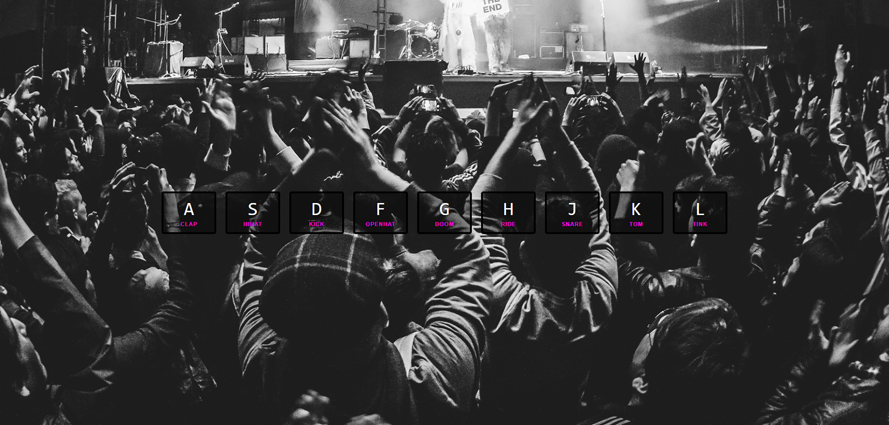

# JavaScript Drum Set

## Description

This project is a simple **JavaScript Drum Set** that allows users to play different drum sounds by pressing specific keys on their keyboard. Each key corresponds to a different sound, and a visual effect is applied when a sound is played.

## Features

- **Interactive drum sounds**: Pressing designated keys will trigger specific sounds.
- **Visual feedback**: Keys will light up and animate when pressed, providing a visual indication of which sound is being played.
- **Responsive sound playing**: Each sound can be played repeatedly in quick succession, as the audio resets before playing.

## How to Use

1. Open the HTML file in a browser.
2. Use the following keys to play drum sounds:
   - `A`: Clap
   - `S`: Hi-hat
   - `D`: Kick
   - `F`: Open Hat
   - `G`: Boom
   - `H`: Ride
   - `J`: Snare
   - `K`: Tom
   - `L`: Tink

## Installation

1. Clone or download the repository.
2. Make sure the **`sounds`** directory contains the appropriate audio files:
   - `clap.wav`
   - `hihat.wav`
   - `kick.wav`
   - `openhat.wav`
   - `boom.wav`
   - `ride.wav`
   - `snare.wav`
   - `tom.wav`
   - `tink.wav`
3. Open the `index.html` file in any modern web browser.

## Technologies Used

- **HTML5**: Markup structure of the page.
- **CSS3**: Used for styling and key animation effects.
- **JavaScript**: Handles the keyboard events and sound playback.

## How It Works

- When a key is pressed, the JavaScript `keydown` event listener triggers the `playSound` function.
- The `playSound` function looks for the corresponding `<audio>` element based on the key pressed and plays the associated sound.
- A CSS transition is applied to the pressed key to create a visual effect.
- The `transitionend` event listener ensures that the visual effect is removed after the animation is complete.

## License

This project is open source and free to use.
